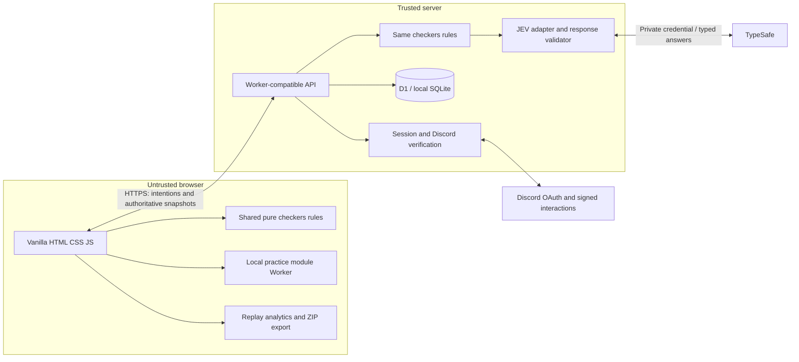
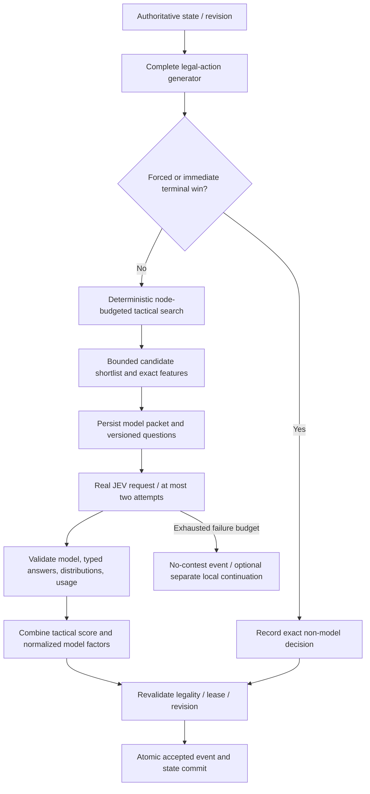
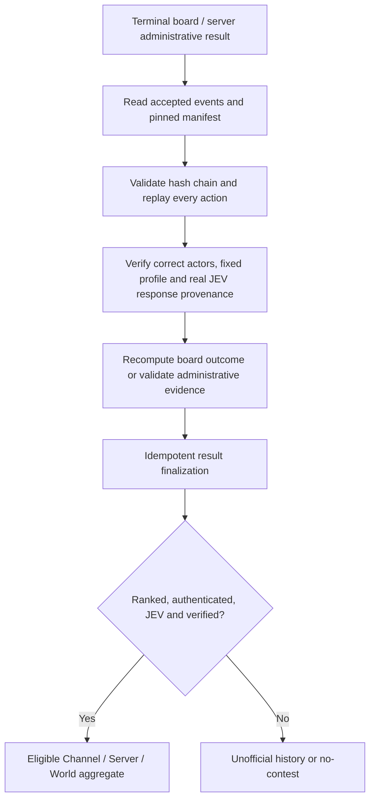

# Implementation architecture

## Runtime and trust boundary



The source uses no production npm packages. Node's development runner adapts HTTP and SQLite to the same Worker handler and D1-like interface. Deployment uses a Worker, static assets, and D1; the Node adapter is not bundled into the Worker dependency graph.

Seven tables have distinct responsibilities: `users`, `sessions`, `grants`, `matches`, `events`, `operations`, and `quotas`. Operations are separate from accepted game events because failed/discarded attempts must remain auditable without changing gameplay state. No ORM or frontend framework is used.

## Pure engine

Thirty-two playable squares, immutable state transitions, generated complete action IDs, deterministic order, explicit rules version. Men move/capture forward; kings use short diagonals. Captures are mandatory globally, but maximum capture is not compulsory. Crowning ends that turn. No-capture/no-man-move progress counter reaches 80 individual turns before the web no-progress draw. The third same-board/side occurrence is an automatic web repetition draw. These automatic procedures are deliberately named `american-8x8-web-v1` rather than claiming all tournament administrative procedures.

All game state stays separate from identities, clocks, network leases, and DOM state. The same engine powers local play, server play, replay, analytics, and benchmarks. There is no gameplay RNG in checkers. Only benchmark fixture/baseline generation uses an explicit seeded generator.

## JEV decision loop



Search is deterministic; accepted remote output is recorded, not presumed deterministic. Root scores use the last complete depth across candidates. Interrupted deeper work consumes nodes but does not create mixed-depth ranking. Candidate features and horizon-limited frontiers are supplied to JEV, never player identities. Numerical facts and legality remain code responsibilities.

## Authentication and context

```mermaid
sequenceDiagram
  participant B as Browser
  participant S as Server
  participant D as Discord
  participant DB as Database
  B->>S: Begin identify OAuth
  S->>DB: Store one-use state bound to session
  S-->>B: Discord authorization redirect
  B->>D: Authorize identity
  D-->>B: Code and state callback
  B->>S: Callback
  S->>DB: Consume matching state
  S->>D: Private code exchange and identity request
  S->>DB: Upsert identity; rotate session and CSRF secret
  S-->>B: HttpOnly application session
```

A separate signed `/play checkers` interaction establishes invoking user, guild, and channel. Signature verification covers timestamp plus the unchanged raw body. A one-use random token is account-bound and stored hashed. Browser redemption requires matching authenticated identity. The token grants one community-attributed match; its context proof permits short-lived leaderboard reading. Arbitrary browser guild/channel IDs are never accepted.

## Authoritative results



D1 batches couple compare-and-swap state updates with inserts gated by the winning commit token. A zero-row conditional update is not treated as successful ownership of a turn. Leases protect opponent work; expired work can retry, but stale completions cannot commit. Exactly-once committed turns do not imply exactly-once remote billing after a crash.

## Recovery and compatibility

The browser polls pending turns and can request owner-only advancement. Post-response Worker work is best-effort, so a scheduled handler recovers persisted pending work and verification. A 24-hour administrative deadline applies to human turns. No-contest is reserved for recorded server-side opponent failure; closing the browser does not erase a ranked game.

Profile hashes freeze rules/engine/search/model/weights. A changed model or strategy is a separate leaderboard cohort. Keep old engine/profile implementations available before changing versions while games remain active; this first release supports its one shipped rules/engine version and does not include an automatic historical-code loader.

## Reuse

Future games can reuse authentication, short-lived community launch, session ownership, operational logging, replay envelopes, provider transport, export, and scoped results. Rules, board representation, move generation, tactical search, and game-specific questions remain isolated. Avoid adding a generic game framework until a second game exposes a concrete need.
